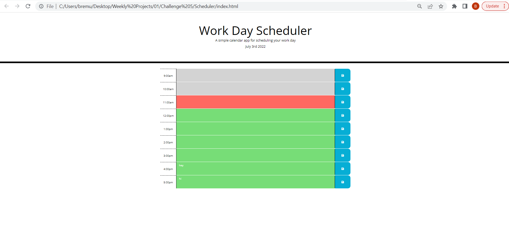

# Scheduler

- Created a simple calender application that allows a user to save events for each hour of the day by modification of a starter code. This app runs in the browser and features dynamically updated HTML and CSS powered by JQuery.
--
## Author

- [@brittanyremus](https://www.github.com/bremus124)
--
## Screenshot

--
## Deployment

- To deploy this project run:
    - Website: https://bremus124.github.io/Scheduler/
    - Repository: https://github.com/bremus124/Scheduler
